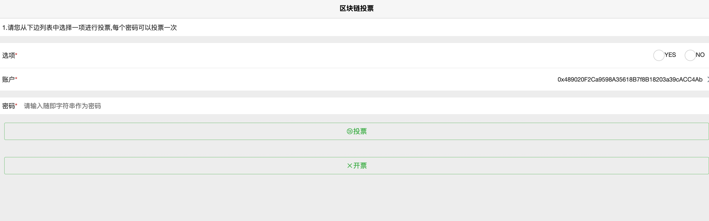
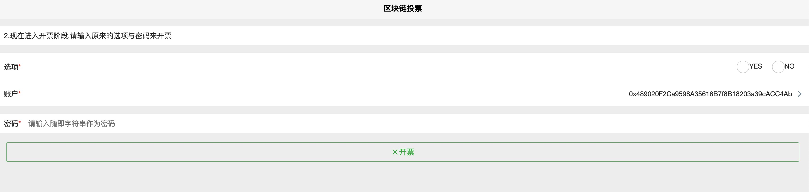
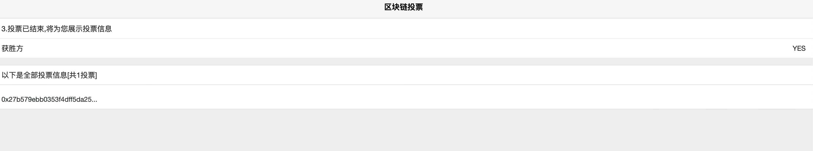

# 下载hbuildx

https://www.dcloud.io/hbuilderx.html

# 导入项目
导入项目,根目录为app

#运行
点击菜单栏的`运行`-`运行到浏览器`
#运行截图
##投票

##开票

##结果

#注意事项
记得替换您的rpcserver和合约部署地址contractaddress的值
修改这个文件app/pages/index/index.vue
```
				rpcserver: 'http://localhost:8545',
				contractaddress: '0x3095dFc4BF0b44732899757f40be03BDa96115f4',
```
